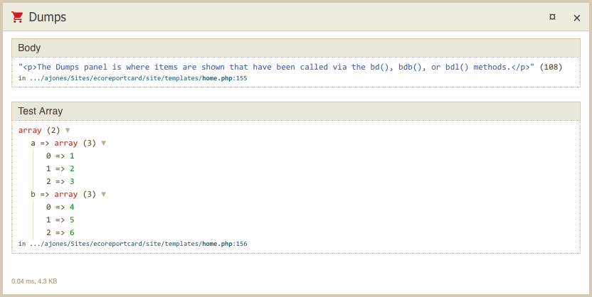
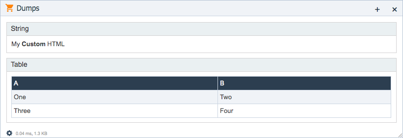
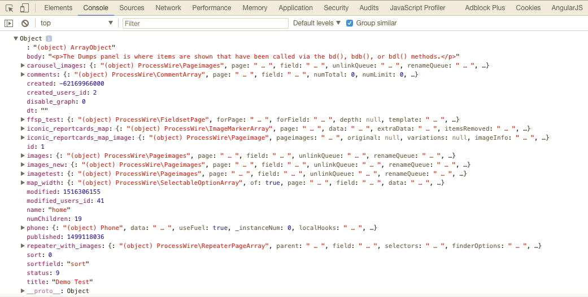

# Debug Methods

The debug methods have three options.

These show an example of each for the barDump method:
* TD::method() `TD::barDump()`
* method() `barDump()`
* shortcut() `bd()`

In most cases using the shortcut is the easiest option, although if you have a conflict with another method you may want to disable the shortcuts via the config settings and use the TD namespaced version.

## addBreakpoint

Method for use with the [Performance Panel](debug-bar.md#performance)

#### Parameters
```php
bp($name, $enforceParent);

/**
* @param string $name
* @param bool $enforceParent (default: false)
*/
```

***

## barDump

Most commonly used debug method. It dumps the variable to a dedicated panel on the debug bar.

#### Parameters
```php
bd($var, $title, $options);

/**
* @param mixed $var string|array|object to be dumped
* @param string $title string to identify this dump
* @param array $options | maxDepth (default:3), maxLength (default:150)
*
* NOTE: default maxDepth and maxLength are configurable in the module config settings,
* but it is recommended to leave as is
*/
```

#### Options Examples

You can adjust the depth of array/objects, and the lengths of strings like this:

```php
bd($myArr, 'My Array', array('maxDepth' => 7, 'maxLength' => 0));
// OR this shortcut
bd($myArr, 'My Array', [7,0]);
```

This can be very handy when you have a deep array or very long string that you need to see more of without changing the defaults of maxDepth: 3 and maxLength: 150 which can cause problems with PW objects if you go too high. Setting to '0' means no limit so don't do this on maxDepth when dumping a PW object - it won't be pretty!

#### Output Examples

Note the second optional parameter used to name the outputs in the Dumps panel.

```php
bd($page->body, 'Body');
bd(array('a' => array(1,2,3), 'b' => array(4,5,6)), 'Test Array');
```



See the **Body** and **Test Array** titles in the output?
Also, note the link to file and line number where these `bd()` calls were triggered. This is linked to open the file to that line in your code editor, the Tracy File Editor, or ProcessFileEdit, depending on your configuration.

***

## barDumpBig

The default `maxDepth` and `maxLength` settings are set to 3 and 150, respectively. This ensure faster rendering performance and is often all you need. You can of course use the `$options` parameter in `bd()` calls to adjust to your exact needs, but this method provides a quick shortcut to a "deeper and longer" version that should be enough in most circumstances.

Shortcut to `bd($var, $title, array('maxDepth' => 6, 'maxLength' => 9999))`

#### Parameters
```php
bdb($var, $title, $options);

/**
* @param mixed $var string|array|object to be dumped
* @param string $title string to identify this dump
* @param array $options | maxDepth (default:3), maxLength (default:150)
*/
```

***

## barEcho

Echos string directly to the dumps panel. It supports HTML.

#### Parameters
```php
be($var, $title, $options);

/**
* @param mixed $var string to be dumped
* @param string $title string to identify this dump
*
*/
```

#### Output Examples

Note the second optional parameter used to name the outputs in the Dumps panel.

```php
be('<p>My <strong>Custom</strong> HTML</p>', 'String');
be('<table><tr><th>A</th><th>B</th></tr><tr><td>One</td><td>Two</td></tr><tr><td>Three</td><td>Four</td></tr></table>', 'Table');
```



See the **String** title in the output?
Also, note the link to file and line number where these `be()` calls were triggered. This is linked to open the file to that line in your code editor, the Tracy File Editor, or ProcessFileEdit, depending on your configuration.

***

## debugAll

Shortcut for outputting via all the dump/log methods via the one call.

#### Parameters
```php
da($var, $title, $options);

/**
* @param mixed $var string|array|object to be dumped
* @param string $title string to identify this dump
* @param array $options | maxDepth (default:3), maxLength (default:150)
*
* NOTE: default maxDepth and maxLength are configurable in the module config settings,
* but it is recommended to leave as is
*/
```


***

## dump

Unlike the barDump methods, this dumps the variable within the DOM of the page where it is called. Generally this method is inferior to the barDump methods, however it is the best option when using the [Console Panel](debug-bar.md#console).

#### Parameters
```php
d($var, $title, $options);

/**
* @param mixed $var string|array|object to be dumped
* @param string $title string to identify this dump
* @param array $options | maxDepth (default:3), maxLength (default:150)
*
* NOTE: default maxDepth and maxLength are configurable in the module config settings,
* but it is recommended to leave as is
*/
```

***


## dumpBig

The default `maxDepth` and `maxLength` settings are set to 3 and 150, respectively. This ensure faster rendering performance and is often all you need. You can of course use the `$options` parameter in `d()` calls to adjust to your exact needs, but this method provides a quick shortcut to a "deeper and longer" version that should be enough in most circumstances.

Shortcut to `d($var, $title, array('maxDepth' => 6, 'maxLength' => 9999))`

#### Parameters
```php
db($var, $title, $options);

/**
* @param mixed $var string|array|object to be dumped
* @param string $title string to identify this dump
* @param array $options | maxDepth (default:3), maxLength (default:150)
*/
```

***

## fireLog

Dumps to the developer console in Chrome or Firefox

#### Parameters
```php
fl($var);

/**
* @param mixed $var string|array|object to be dumped
*/
```

#### Output Examples

```php
fl($page->getIterator());
```


This is very useful when using PHP to generate a file for output where the other dump methods won't work. It can also be useful dumping variables during AJAX requests.

To make this work you must first install these browser extensions:

**Chrome:**

[https://github.com/MattSkala/chrome-firelogger](https://github.com/MattSkala/chrome-firelogger)

**Firefox:**

[http://www.getfirebug.com/](http://www.getfirebug.com/)

[http://firelogger.binaryage.com/](http://firelogger.binaryage.com/)

***

## log

Useful if you want to store the results over multiple page requests.

#### Parameters
```php
l($var, $priority);

/**
* @param string $var string to be logged
* @param string $priority | "debug", "info", "warning", "error", "exception", "critical" (default: info)
*/
```
The priority setting reflects the name of the file that will be stored in /site/assets/logs/tracy/


***

## templateVars

Extracts just the template variables, removing all ProcessWire variables.

#### Parameters
```php
tv(get_defined_vars());
```

***

## timer

Determines time it takes to execute a block of code.

#### Parameters
```php
t($name)

/**
* @param string $name string
*/
```

#### Output Examples
```php
t();
// insert resource intensive code here
sleep(2);
bd(t());
```
You can also add an optional name parameter to each timer() call and then dump several at once in a single page load.

***